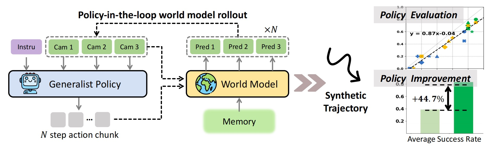

<div align="center">
<h2><center>👉 Ctrl-World: A Controllable Generative World Model for Robot Manipulation </h2>

[Yanjiang Guo*](https://robert-gyj.github.io), [Lucy Xiaoyang Shi*](https://cospui.github.io),  [Jianyu Chen](http://people.iiis.tsinghua.edu.cn/~jychen/), [Chelsea Finn](https://causallu.com)

 \*Equal contribution; Stanford University, Tsinghua University


<a href='https://arxiv.org/abs/2412.14803'></a> 
<a href='https://video-prediction-policy.github.io'></a> 

</div>

This repo is the official PyTorch implementation for  [**Ctrl-World**](https://arxiv.org/abs/2412.14803) paper.

**TL; DR:** Ctrl-World is an action-conditioned world model compatible with modern VLA policies and enables policy-in-the-loop rollouts entirely in imagination, which can be used to evaluate and improve the instruction following ability of VLA. 

<p>
    
</p>


##  Content

**1. Generate synthetic trajectory via replay the actions recorded in DROID datasets.** 

**2. Generate synthetic trajectory via interaction between Ctrl-World and VLA model $\pi_{0.5}$.**

**3. Whole training pipeline of Ctrl-World on DROID dataset.**

## 0. Installation 🛠️


```bash
conda create -n ctrl-world python==3.11
conda activate ctrl-world
pip install -r requirements.txt

#  If you want to use ctrl-world to interact with $\pi_{0.5}$ model, fowllowing the pi official repo to install the pi model dependencies. Otherwise you can skip it.
# (from https://github.com/Physical-Intelligence/openpi/tree/main)
git clone --recurse-submodules git@github.com:Physical-Intelligence/openpi.git
cd openpi
pip install uv
GIT_LFS_SKIP_SMUDGE=1 uv sync
GIT_LFS_SKIP_SMUDGE=1 uv pip install -e .
```


## 1. CheckPoint and Dataset 📷


| Ckpt name     | Training type | Size |
|---------------|------------------|---------|
| [clip-vit-base-patch32](https://huggingface.co/openai/clip-vit-base-patch32)  | CLIP text and image encoder    |  ~600M   |
| [svd](https://huggingface.co/stabilityai/stable-video-diffusion-img2vid)  | Pretrained SVD video diffusion model   | ~8G    |
| [Ctrl-World](https://huggingface.co/stabilityai/stable-video-diffusion-img2vid) |   Ctrl-World model trained on DROID dataset  | ~8G   |
| [DROID Dataset]() |   Opensourced DROID dataset, ~95k traj, 564 scene    |  ~370G  |


<!-- **📊 Replay opensourced trajectory:** If you want to replay 

**📊 Replicate results on calvin abc:** If you want to replicate results on calvin abc, download the svd-robot-calvin model.

**📊  Train VPP in cunstom environments**: If you want to run VPP algorithm on your own robot, download the svd-robot model and follow instructions in the training section. -->


## 2. Ctrl-World Inference 📊
### 📊 (1) Replay the recorded trajectories with world model.
**Task Description:** We start from an initial observation sampled from the recorded trajectories and then generate long trajectories by replaying the recorded actions. At each interaction step, a 1-second action chunk is provided to the world model, and the interaction is repeated multiple times to produce the full rollout. 

We provide a very small subset of DROID dataset in `dataset_example/droid_subset`. After download the ckpt in section 1, you can directly run the following command to replay some long trajectories:


```bash
CUDA_VISIBLE_DEVICES=0 python rollout_replay_traj.py  --dataset_root_path dataset_example --dataset_meta_info_path dataset_meta_info --dataset_names droid_subset --svd_model_path ${path to svd folder} --clip_model_path ${path to clip folder} --ckpt_path ${path to ctrl-world ckpt}
```
The rollout configuration can be found in `config.py`.
If you want to replay more trajectories, you need to download and process the original DROID datasets following the instructions in training section.


### 📊 (2) Interact with $\pi_{0.5}$ model within world model

**Task Description:** We take some snapshot from a new DROID setup and perform policy-in-the-loop rollouts inside world model. Both $\pi_{0.5}$ and Ctrl-World need to zero-shot transferr to new setups.

On our new droid setup, we tried tasks including `task_types = ['pickplace', 'towel_fold', 'wipe_table', 'tissue', 'close_laptop','tissue','drawer','stack']`. We provide some snapshots in `dataset_example/droid_new_setup`.

```bash
python make_prediction.py --eval --config video_conf/val_svd.yaml --video_model_path ${path to svd-robot} --clip_model_path ${path to clip} --val_dataset_dir video_dataset_instance/xhand --val_idx 0+50+100+150
```

You can try more video predictions with samples in video_dataset_instance.
`val_dataset_dir` is the root to datasets and `val_idx` is the sample index. The generated video is save in the folder`video_output`. 


## Training Ctrl-World

We use DROID dataset as an example to train Ctrl-World

### 🛸 (0) Training requirements
Our experiments are run on one node with 8 A100/H100 cards.

### 🛸 (1) Prepare dataset
(1) Since the video diffusion model are run in latent space of image encoder, we need to first extract the latent sapce of the video. This process will save GPU memory cost and reduce training time. Run `step1_prepare_latent_data.py` to prepare latent. The dataset format should be similar to `video_dataset_instance`. 

We have extract features for something-something-v2, bridge, rt1 and calvin, and you can directly download them from [huggingface dataset:vpp_svd_latent](https://huggingface.co/datasets/yjguo/vpp_svd_latent/tree/main)

(2) After prepare the latent, you need to reset the following parameters in `video_conf/train_svd.yaml`: `dataset_dir` is the root path of datasets; `dataset` is different video dataset used for finetuning and connected with `+`; `prob` is the sample ratio of each dataset. 

```bash
accelerate launch --main_process_port 29506 step1_train_svd.py --config video_conf/train_calvin_svd.yaml --pretrained_model_path ${path to svd-robot}
```


## Acknowledgement

Video prediction policy is developed from the opensourced video foundation model [Stable-Video-Diffusion](https://github.com/Stability-AI/generative-models). We thank the authors for their efforts!


## Bibtex 
If you find our work helpful, please leave us a star and cite our paper. Thank you!
```
@article{hu2024video,
  title={Video Prediction Policy: A Generalist Robot Policy with Predictive Visual Representations},
  author={Hu, Yucheng and Guo, Yanjiang and Wang, Pengchao and Chen, Xiaoyu and Wang, Yen-Jen and Zhang, Jianke and Sreenath, Koushil and Lu, Chaochao and Chen, Jianyu},
  journal={arXiv preprint arXiv:2412.14803},
  year={2024}
}